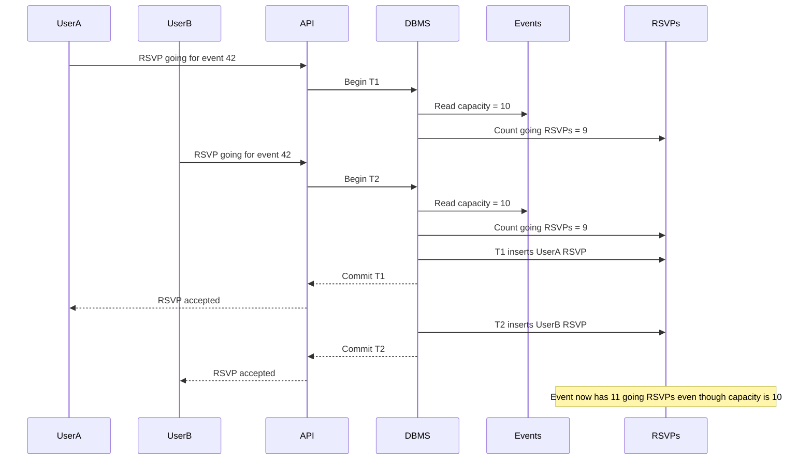
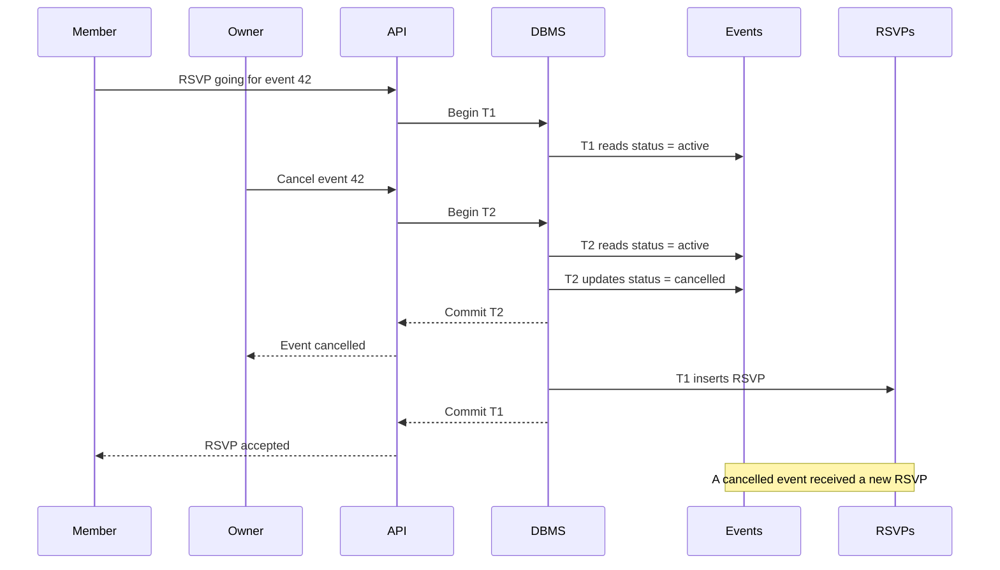
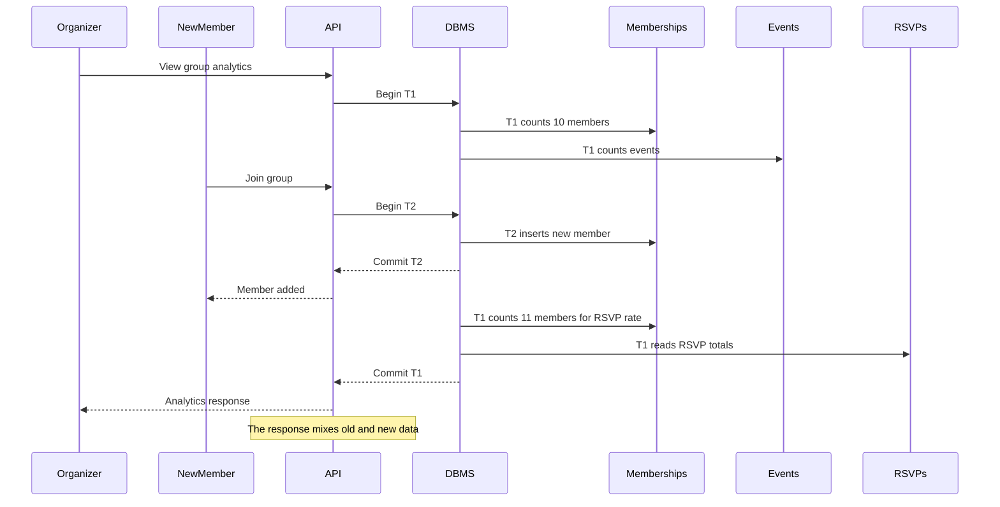

# Concurrency Problems

## 1. Phantom Read / Write Skew: Too Many People RSVP

An event has a capacity, so we do not want more people marked as `going` than the event allows. Suppose an event has 10 seats and 9 people are already going. If two users RSVP at the same time, both transactions might count 9 people and think there is still one open spot. Then both insert their RSVP, and the event ends up with 11 people going.

To prevent this, the RSVP transaction should lock the event row with `SELECT ... FOR UPDATE` before checking capacity and inserting/updating the RSVP. This works because capacity belongs to one event, so locking that one event forces RSVP decisions for that event to happen one at a time.

## 2. Non-Repeatable Read: RSVP During Event Cancellation

The RSVP endpoint checks if an event is active before accepting an RSVP. The cancel event endpoint changes the event status from `active` to `cancelled`. Without isolation, a user could start an RSVP transaction, see that the event is active, and then an owner could cancel the event before the RSVP transaction finishes. The RSVP might still get inserted even though the event is now cancelled.

To prevent this, both RSVP and cancellation should lock the same event row with `SELECT ... FOR UPDATE`. Then one transaction has to wait for the other. If the cancellation happens first, the RSVP transaction will see `cancelled` and reject the RSVP. If the RSVP happens first, then the cancellation happens after a valid RSVP update.

## 3. Read Skew / Phantom Read: Weird Analytics Results

The group analytics endpoint runs multiple queries. It counts members, counts events, calculates RSVP rate, and lists active members. If another transaction adds a member or RSVP while the analytics request is running, the report might use data from different moments in time.

For example, the first query might say the group has 10 members. Then another user gets added. A later query in the same analytics request might calculate RSVP rate using 11 members. The final response would not match one real version of the database.

To prevent this, dashboard and analytics reads should use a `REPEATABLE READ READ ONLY` transaction. That gives the whole report one consistent snapshot of the database. It is a good choice because analytics does not need to block people from creating events or RSVPs; it just needs to show numbers that all come from the same point in time.

## What We Should Use

For RSVP and cancellation transactions, we should use row-level locks with `SELECT ... FOR UPDATE` on the event row. This protects the important event rules without locking the whole database.

For dashboard and analytics transactions, we should use `REPEATABLE READ READ ONLY` so the response is consistent.

We should also keep using database constraints like unique keys and primary keys. For example, `PRIMARY KEY (event_id, user_id)` on RSVPs prevents the same user from having two RSVP rows for the same event.
